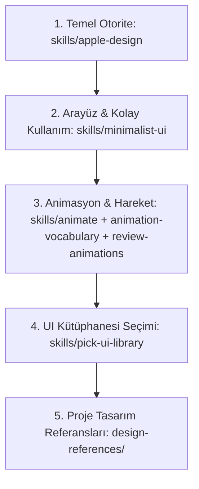

# Curate Studio — UI/UX ve Frontend Tasarım Hiyerarşisi

Bu döküman, Curate projesinde yapılacak her türlü UI/UX, animasyon, stil ve frontend geliştirme işinde tüm yapay zeka ajanları (Antigravity agents) için **bağlayıcı temel kural setidir**. Herhangi bir frontend veya tasarım işine başlamadan önce bu hiyerarşi sırasıyla uygulanmalıdır.

---

## 1. Otorite Hiyerarşisi (Bağlayıcı Öncelik Sıralaması)

### 1. Temel Otorite: `skills/apple-design`
Tüm arayüz kararlarında mutlak 1 numaralı referanstır.
- **Akışkan Fizik (Fluid Interfaces):** Hareketler kullanıcının temas ettiği noktadan başlar (`setPointerCapture`, grab offset korunur).
- **Kesintiye Uğratılabilirlik (Interruptibility):** Animasyonlar asla kullanıcıyı kilitlemez. Ortasında yakalanabilir, yönü anında değiştirilebilir.
- **Yay Fiziği (Spring Physics):** Keyframe ve sabit süreli CSS yerine dokunulabilen öğelerde yaylar kullanılır. UI varsayılanı: kritik sönümlü (critically damped `damping 1.0`, `response 0.3–0.4`).
- **Gecikmesiz Geri Bildirim:** Tıklama bırakıldığında değil, `pointerdown` anında anında tepki (örn. `scale(0.97)`).
- **Yarı Saydam Malzemeler (Materials & Depth):** `backdrop-filter: blur(...)`, ışık yakalayan 1px kenarlıklar (`border-white/10` - `border-white/15`), yüzen işlevsel katmanlar.
- **Optik Tipografi:** Büyük başlıklarda negatif tracking (`letter-spacing: -0.02em`), küçük metinlerde nötr/hafif pozitif tracking; sistem fontları (`system-ui`, `-apple-system`).
- **Tasarım Temelleri:** Amaç (Purpose), Kullanıcı Hakimiyeti (Agency), Zanaat (Craft), Sadelik (Simplicity) ve Nezaket (Deference Principle).

### 2. Arayüzde Kolay ve Rahat Kullanım: `skills/minimalist-ui`
Zahmetsiz, dingin, editoryal ve süssüz ergonomi.
- **Bilişsel Yükü Sıfırlama:** Kullanıcıyı slider ve teknik ayarlarla boğmama. Tek tıkla çalışan, net ve doğrudan çözümler.
- **Sıcak & OLED Monokrom:** Saf siyah zemin (`#000000`, `#0A0A0A`), sessiz kartlar, 1px net sınırlar.
- **Katmanlı İfşa (Progressive Disclosure):** Varsayılan görünümde yalnızca en çok ihtiyaç duyulan ana eylem (Preset seçimi); ince ayarlar ve karmaşık araçlar katlanmış (collapsed) bölümlerde.
- **Asla Kullanılmayacaklar:** Ağır Tailwind drop shadow'ları, jenerik neon degradeler, gereksiz emojiler, kalabalık buton karmaşası.

### 3. Animasyon ve Hareket Zanaatı:
- **`skills/animate`:**
  - Animasyon karar dizisini sırayla uygula: Gerçekten hareket etmeli mi? Amacı ne (Feedback, Spatial Consistency, State)? En ucuz araç hangisi?
  - Yalnızca GPU dostu özellikler: `transform` ve `opacity` (asla `width`, `height`, `top`, `left` animasyonu yapılmaz).
  - Asla `scale(0)` kullanılmaz; `scale(0.95-0.97)` + `opacity: 0` kullanılır.
  - UI animasyonları kesinlikle 300ms altındadır (`cubic-bezier(0.23, 1, 0.32, 1)`). UI'da `ease-in` yasaktır!
- **`skills/animation-vocabulary`:** Terminoloji ve etki eşleştirme (pop-in, stagger, rubber-banding, origin-aware).
- **`skills/review-animations`:** Emil Kowalski zanaat çıtası. On tavizsiz standart, agresif eskalasyon kontrolleri.

### 4. UI Kütüphanesi Seçimi: `skills/pick-ui-library`
Bileşen ihtiyacı doğduğunda rastgele paket aramak yerine standart kürasyon kullanılır:
- Primitives/Erişilebilirlik: `base-ui`
- Animasyonlar/Springs: `motion` (Framer Motion)
- Bildirimler: `sonner`
- Komut Paleti: `cmdk`
- Sayı Sayaçları: `number-flow`

### 5. Proje Tasarım Referansları (`design-references/`)
- `premium-design-philosophy.md`: Lüks, sakin, güven veren fotoğraf stüdyosu hissi.
- `dark-mode-first.md`: OLED siyah stüdyo ambiyansı, göz yormayan karanlık tema.
- `glassmorphism.md` & `liquid-glass-visual-identity-guidelines.md`: Lens kırılımları, zemin blur'ları ve ışık yakalayan frosted kenarlar.
- `60-30-10-renk-kurali.md`: %60 zemin, %30 yapısal cam yüzeyler, %10 amber vurgu (`#F59E0B`).
- `ux-laws-reference.md`: Fitts, Hick, Miller kanunları ve Doherty eşiği (<100ms anında tepki).
- `touch-hover-capability.md`: Min 44x44px dokunma hedefleri, `@media (hover: hover) and (pointer: fine)` korumaları.
- `loading-states-process-feedback.md`: İpeksi shimmer ve kullanıcıyı bloke etmeyen geri bildirim.
- `autosave-rehberi.md`: Kesintisiz yerel kayıt (localStorage) ve veri koruma.
- `bento-grid.md` & `card-based.md`: Modüler kart mimarisi.

---

## 2. Prensip: Frontend Direktiflerinde Öncelik

Bir spec veya görev dökümanında (`curate-preset-spec.md` vb.) frontend talimatları bulunduğunda:
1. **Kullanıcının işlevsel ve estetik tercihleri** (hangi presetler, hangi değerler, hangi akış) spec'teki gibi aynen korunur.
2. **Frontend arayüz, kodlama ve hareket tasarımı direktifleri** ise doğrudan yukarıdaki `skills/apple-design` merkezli hiyerarşi ile harmanlanır ve üst seviyeye taşınır.
3. Hiçbir zaman basit, ucuz ya da jenerik bir MVP yapılmaz; Apple kalitesinde, akışkan ve ödün vermeyen bir zanaatla üretilir.
